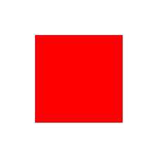

# Data Augmentation with Keras

This project demonstrates how to apply **data augmentation techniques** using Keras to artificially expand and improve a dataset. By transforming existing images, the model is exposed to more variations, which helps it generalize better during training.

---

##  Overview

The notebook focuses on preparing image data for training by generating modified versions of the same image. Instead of collecting more data, augmentation creates new samples from existing ones.

This is especially useful when working with **small datasets**, where models tend to overfit.

---

##  Core Idea

Data augmentation applies random transformations to images while preserving their meaning.

Typical transformations include:

- rotation  
- shifting  
- zooming  
- flipping  
- rescaling  

These transformations simulate real-world variations and make the model more robust.

---

##  Workflow

The notebook follows these main steps:

1. Load an image  
2. Convert it into a format suitable for processing  
3. Apply augmentation transformations  
4. Generate multiple variations of the same image  
5. Visualize the augmented outputs  

---

##  Example Image

The project uses an input image stored in the repository:





This image is used as the base input to generate multiple augmented versions.

---

##  Augmentation Process

Using Keras, an image generator is defined with transformation parameters. Each time the generator is used, it produces a slightly different version of the same image.

This allows the dataset to effectively grow without adding new raw data.

---

##  Why Data Augmentation?

- reduces overfitting  
- improves model generalization  
- increases dataset diversity  
- makes models more robust to real-world variations  

---

##  File Structure

```

Keras-dataAugmentation.ipynb   # main notebook
sample.jpg                    # input image used for augmentation
README.md                     # project documentation

```

---

##  Summary

This project shows how to use Keras to generate multiple variations of a single image, helping models learn more effectively from limited data by simulating real-world diversity.
```
